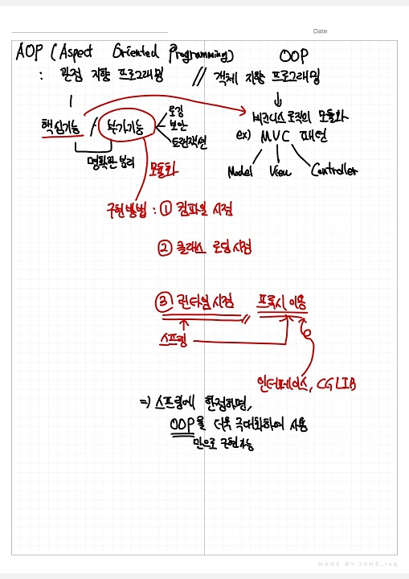
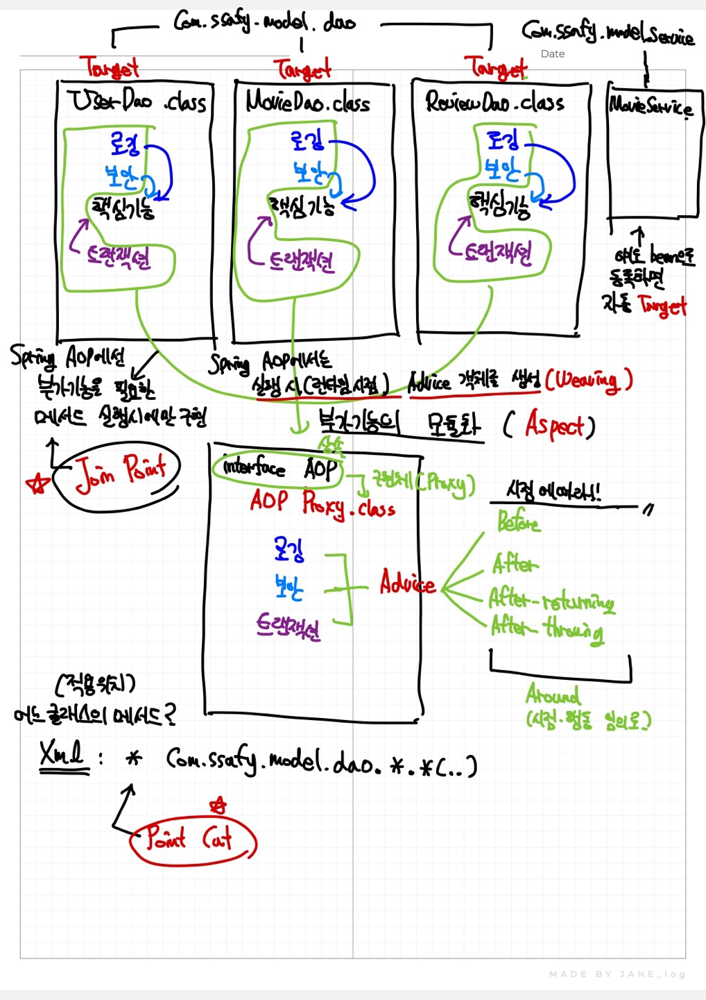
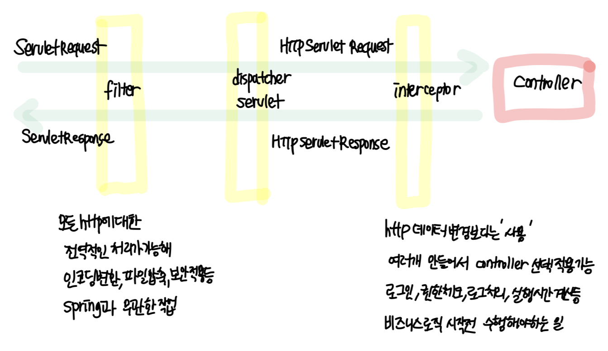

# 💡SPRING DI

## DI(Dependency Injection) 의존성 주입

A 객체가 어떤 일을 처리하기 위해서 B 객체의 도움을 받아야 한다면 A가 B에 의존한다.

### 🔍 의존관계 역전

- 객체 생성 의존성 제거
- 타입 의존성 제거

의존관계 역전이란, 객체에 존재하는 의존관계들을 제거하고, 그 의존관계를 객체 외부로 넘기는 것을 말한다.

### 🔍 의존성 주입

```java
public class Person {

    private Food food;

    // 1. 생성자에 food를 주입한다
    public  Person(Food food){
        this.food = food;
    }

    //2. 설정자에 food를 주입한다.
    public setFood(Food food){
        this.food = food;
    }

    public void eat(){
        System.out.println(food.name() + "을 먹는다");
    }
}
```

### 🔍 Spring IoC Container(Spring Inversion of Control Container)

- Bean : 스프링에서 핵심적인 역할을 하는 객체
- Container : Bean의 인스턴스화 조립, 관리, 사용 소멸에 대한 처리 담당

### 🔍 스프링 설정 정보

설정 정보를 작성하는 방법은 총 3가지

```
(1) XML방식
(2) Annotation방식
(3) Java 방식
```

### 🔍 bean 직접 등록 예시

#### (1) 빈등록

```xml
<bean class="com.ssafy.test.Person" id = "person"/>
```

#### (2) 생성자 주입

```xml
<bean class="com.ssafy.test.Chicken" id = "chicken"/>
<bean class="com.ssafy.test.Person" id = "person">
    <constructor-arg ref="chicken"/>
</bean>
```

#### (3) 설정자 주입

**name** : setter와 매핑(setFood -> food)

**ref** : 참조할 Bean의 id

```xml
<bean class="com.ssafy.test.Pizza" id = "pizza"/>
<bean class="com.ssafy.test.Person" id = "person">
    <property name="food" ref="pizza"/>
</bean>
```

### 🔍 Annotation으로 의존성 주입

```java
interface Food {
	String getName();
}

@Component
class Chicken implements Food{
	public String getName() {
		return "치킨";
	}
}
@Component
class Pizza implements Food{
	public String getName() {
		return "피자";
	}

}

class Person{

    //1. 필드주입
    @Autowired
    @Qaulifier("beanName")
    private Food food;

    //2. 생성자 주입
    @Autowired
    public Person(@Qualifier("beanName")Food food){
    	this.food = food;
    }

    //3. 설정자 주입
    @Autowired
    public void setFood(@Qaulifier("beanName")Food food) {
    	this.food = food;
    }

    public void eat(){
        System.out.println(food.getName() + "을(를) 먹습니다");
    }
}

```

### 🔍 Bean Scope

`Bean 범위를 정의해서 객체의 범위를 제어할 수 있다.`

(1) singleton : 기본값. 단일 객체 인스턴스

(2) prototype : 빈을 요청할 때 마다 새로운 인스턴스 생성

(3) request : HTTP Request 주기로 bean 인스턴스 생성

(4) session : HTTP Session 주기로 bean 인스턴스 생성

# SPRING AOP

 \
 \

# SPRING MVC

# SPRING Interceptor (1)

## Servlet Container와 Spring Container


## MVC 요청 흐름


1. 클라이언트가 요청을 보냄
2. Handler Mapping을 통해서 매핑할 핸들러를 찾아낸다.
3. 핸들러를 실행시켜 컨트롤러가 실행되며 서비스로직이 돌아간다.
4. 결과적으로 Model이 생성되고, 선택한 View의 이름을 반환한다.

   이 때 ModelAndView와 String(viewname) 둘 다 가능하다.

5. 반환값의 View 이름을 가지고 ViewResolver에서 해당 View 오브젝트를 찾아 Model과 데이터 바인딩 시킨다.
6. 최종적으로 완성된 View를 DispatcherServlet이 반환한다.

## Listener

프로그래밍에서 Listener란 특정 이벤트가 발생하기를 기다리다가 실행되는 객체

이벤트란 특정한 사건이 발생하는 것을 의미

ex) 버튼 클릭, 키보드 입력, 컨테이너 빌드 완료, 웹 어플리케이션 시작, HTTP 요청 수신

이벤트 소스란 이벤트가 발생한 근원지(객체)

1. Annotation로 @WebListener 을 적어서 이용할 수도 있음

   ```java
   @WebListener
   public class MyListener implements ServletContextListener {
   	public void contextDestroyed(ServeletContextEvent sce) {
   		System.out.println("웹어플리케이션 종료될 때 호출1");
   	}

   	public void contextDestroyed(ServeletContextEvent sce) {
   		System.out.println("웹어플리케이션 종료될 때 호출1");
   		ServletContext context = sce.getServletContext();
   		System.out.println("welcome : " + context.getInitParameter("welcome"));
   	}
   }
   ```

2. web.xml

   ```xml
   <listener>
   		<listener-class>com.ssafy.mvc.MyListener2</listener-class>
   </listener>
   <context-param>
   		<param-name>welcome</param-name>
   		<param-value>Hello SSAFY</param-name>
   </context-param>.
   ```

   ```java
   public class MyListener2 implements ServletContextListener {
   	public void contextDestroyed(ServeletContextEvent sce) {
   		System.out.println("웹어플리케이션 종료될 때 호출2");
   	}

   	public void contextDestroyed(ServeletContextEvent sce) {
   		System.out.println("웹어플리케이션 종료될 때 호출2");
   		ServletContext context = sce.getServletContext();
   		System.out.println("welcome : " + context.getInitParameter("welcome"));
   	}
   }
   ```

## Filter와 Interceptor



## Filter

요청과 응답 데이터를 필터링하여 제어, 변경하는 역할

사용자의 요청이 Servlet에 전달되어지기 전에 Filter를 거침

Servlet으로부터 응답이 사용자에게 전달되어지기 전에 Filter를 거침

FilterChain을 통해 연쇄적으로 동작 가능 ⇒ 순서에 영향 받음

```java
public class MyFilter implements Filter {

		public FilterConfig filterConfig;

    // 요청이 들어오면 필터를 초기화
    @Override
    public void init(FilterConfig filterConfig) throws ServletException {
        log.info("✨Filter - init: 필터 서블릿 초기화");
        this.filterConfig = filterConfig;
    }

    // 필터의 동작을 구현
    @Override
    public void doFilter(ServletRequest request, ServletResponse response, FilterChain chain) throws IOException, ServletException {
        // DispatcherServlet으로 넘기기 전에 실행
        log.info("✨Filter - doFilter start: 필터 시작");
	       String encoding = this.filterConfig.getInitParameter("encoding");
				 request.setCharacterEncoding(encoding);
				// 필터체인이 실행되고 마지막 필터에서 요청을 DispatcherServlet으로 넘김
        chain.doFilter(request, response);
        // DispatcherServlet에서 응답이 반환된 후 실행
        log.info("✨Filter - doFilter end: 필터 끝");
    }

    // 필터 종료
    @Override
    public void destroy() {
        log.info("✨Filter - destroy: 필터 서블릿 제거");
        Filter.super.destroy();
    }
}
```

```xml
<filter>
	<filter-name>MyFilter</filter-name>
	<filter-class>com.ssafy.mvc.MyFilter</filter-class>
	<init-param>
		<param-name>encoding</param-name>
		<param-value>utf-8</param-value>
	</init-param>
</filter>
<filter-mapping>
	<filter-name>MyFilter</filter-name>
	<url-pattern>/*</url-pattern>
</filter-mapping>
```

## 인터셉터

HandlerInterceptor[인터페이스]를 구현한 것(또는 HandlerInterceptorAdapter[클래스]를 상속한 것)

요청을 처리하는 과정에서 요청을 가로채서 처리

접근 제어(Auth), 로그(Log) 등 **비즈니스 로직과 구분되는 반복적이고 부수적인 로직 처리**

**HandlerInterceptor의 주요 메서드**

- preHandle()
  Controller 실행 이전에 호출
  false를 반환하면 요청을 종료한다.
  true를 반환하면 그대로 진행한다.
  ```java
  public boolean preHandle(HttpServletRequest request, HttpServletResponse response, Object Handler) {}
  ```
- postHandle()
  Controller 실행 후 호출
  정상 실행 후 추가 기능을 구현할 때 사용하기 때문에 ModelAndView 객체가 함께 들어있음
  Controller에서 예외 발생시 해당 메서드는 실행되지 않음
  ```java
  public void postHandle(HttpServletRequest request, HttpServletResponse response, Object Handler, ModelAndView modelAndView)
  ```
- afterCompletion()
  뷰가 클라이언트에게 응답을 전송한 뒤 실행
  Controller에서 예외 발생시, 네번째 파라미터로 전달(기본은 null)
  Controller에서 발생한 예외 혹은 실행 시간 같은 것들을 기록하는 등 후처리시 주로 사용
  ```java
  public void afterCompletion(HttpServletRequest request, HttpServletResponse response, Object handler, Exception ex) throws Exception {}
  ```

# SPRING Interceptor (2)

# MyBatis - Dynamic SQL (1)

# Mybatis-Spring

> 정의

- 데이터베이스 연동을 위한 자바 퍼시스턴스 프레임워크 중 하나로, SQL 쿼리와 자바 객체 간의 매핑을 효율적으로 처리하기 위한 라이브러리
- SQL, 동적 쿼리, 저장 프로시저 그리고 매핑을 지원하는 SQL Mapper이다.
- JDBC로 처리하는 커넥션 코드 및 변수 등 중복 작업과 파라미터 설정 및 결과 처리를 대신해준다.

> 특징

- SQL쿼리들을 따로 XML파일로 작성하여 프로그램 코드와 SQL문을 코드관리 용이
- 싱글톤 패턴으로 스프링 빈(bean)으로 등록하여 주입(DI)하여 쉽게 사용 가능
- 스프링 연동 모듈을 제공해주기 때문에 스프링 설정이 간단함
- 트랜잭션을 관리해주기 쉽게 설정이 가능함
- JDBC와 차이점
<table border="1" text-align: center>
<th>JDBC</th>
<th>Mybatis</th>
<tr><!-- 첫번째 줄 시작 -->
    <td>직접 Connection을 맺고 마지막에 close()<br>
       PreparedStatement 직접 생성 및 처리<br>
       PreparedStatement의 setXXX() 등에 대한 모든 작업을 개발자가 처리<br>
       SELECT의 경우 직접 ResultSet 처리</td>
    <td>자동으로 Connection close()기능<br>
       MyBatis 내부적으로 PreparedStatement 처리<br>
       #{prop}와 같이 속성을 지정하면 내부적으로 자동 처리<br>
       리턴 타입을 지정하는 경우 자동으로 객체 생성 및 ResultSet 처리</td>
</tr><!-- 첫번째 줄 끝 -->
   </table>

> MyBatis의 DB Access Architecture


- 기존 JDBC 프로그래밍의 경우 Repository에서 곧바로 JDBC API쪽으로 접근하여 DB를 연결하였지만, 위의 그림에 나와있듯이 Mybatis을 사용할 경우 Repository와 JDBC API사이에 MyBatis가 위치함으로써 편리한 Access를 제공한다.

> MyBatis의 주요 컴포넌트

- MyBatis 설정파일(mybatis-config.xml)
  - DB의 접속 정보 또는 Mapping 파일의 경로, alias 등을 설정하는 XML 파일
- SqlSessionFactoryBuilder
  - MyBatis 설정파일을 읽고 SqlSessionFactory를 생성
- SqlSessionFactory (Interface)
  - SqlSession을 생성
- <b>SqlSession (가장 핵심적인 역할)
  - mapper.xml에 등록된 SQL의 실행이나 트랙잭션을 관리하는 인터페이스
  - Spring 프로젝트의 DAO에 직접 접근하여 쿼리를 수행함
  - Thread-safe 하지 않으므로 thread를 매번 필요에 따라 생성해야함</b>
- Mapping 파일(mapper.xml)
  - SQL과 객체 매핑설정을 하는 XML 파일

> MyBatis의 DB Access 순서


#### ✔ 애플리케이션 실행시 시작되는 프로세스

(1) 애플리케이션이 SqlSessionFactoryBuilder를 위해 SqlSessionFactory를 빌드하도록 요청<br>
(2) SqlSessionFactoryBuilder는 SqlSessionFactory를 생성하기 위해 MyBatis 설정 파일을 읽음<br>
(3) SqlSessionFactoryBuilder는 MyBatis 설정 파일의 정의에 따라 SqlSessionFactory를 생성

#### ✔ 클라이언트의 요청에 따라 수행되는 프로세스

(4) 클라이언트의 애플리케이션에 대한 요청<br>
(5) 애플리케이션은 SqlSessionFactoryBuilder를 사용하여 빌드된 SqlSessioFactory에서 SqlSession을 가져옴<br>
(6) SqlSessionFactory는 SqlSession 생성하고 이를 애플리케이션에 반환<br>
(7) 애플리케이션이 SqlSession에서 Mapper Interface 구현 개체를 가져옴<br>
(8) 애플리케이션에서 Mapper Interface의 메소드를 호출<br>
(9) Mapper Interfcae의 구현 개체가 SqlSession메소드를 호출하고 SQL 실행 요청<br>
(10) SqlSession은 Mapping File에서 실행할 SQL을 찾아서 실행

#### ✔ 관련 라이브러리


- pom.xml
  - Maven 빌드 도구를 사용하는 Java 프로젝트의 설정 파일
- applicationContext.xml
  - Spring 애플리케이션의 일반적인 설정 파일로, 웹 애플리케이션 빈과 로직과 관련된 설정을 정의
- root-context.xml
  - 전역적인 애플리케이션 설정 정보를 정의
  - web.xml 파일에서 가장 먼저 읽어들이는 설정 파일
- servlet-context.xml
  - 요청과 관련된 각각의 서블릿에 대한 설정 정보를 정의
  - url과 관련된 controller나, @(어노테이션), ViewResolver, Interceptor, MultipartResolver 등의 설정
- xxMapper.xml
  - 데이터베이스와 자바 객체 간의 매핑과 SQL 쿼리를 정의하는 역할을 함
  - 각각의 매퍼 XML 파일은 특정 데이터베이스 테이블 또는 객체와 관련된 SQL 쿼리와 결과 매핑을 담당
  - 보통 CRUD (Create, Read, Update, Delete) 연산과 관련된 SQL이 여기에 정의됨

#### ✔ 관련 라이브러리 Code

<details>
  <summary>pom.xml</summary>
  1) MyBatis / MyBatis-Spring : MyBatis와 스프링 연동용 라이브러리<br>
  2) spring-jdbc / spring-tx : 스프링에서 데이터베이스 처리와 트랜잭션 처리

- MyBatis를 사용하려면 4가지를 모두 추가해야함
     <div markdown="1">

    <!-- MyBatis -->

      <dependency>
      	<groupId>org.mybatis</groupId>
      	<artifactId>mybatis</artifactId>
      	<version>3.4.6</version>
      </dependency>

  <!--MyBatis-Spring-->

      <dependency>
      	<groupId>org.mybatis</groupId>
      	<artifactId>mybatis-spring</artifactId>
      	<version>1.3.2</version>
      </dependency>

    <!-- spring-tx -->

      <dependency>
      	<groupId>org.springframework</groupId>
      	<artifactId>spring-tx</artifactId>
      	<version>5.0.7.RELEASE</version>
      </dependency>

  <!-- spring-jdbc -->

      <dependency>
      	<groupId>org.springframework</groupId>
      	<artifactId>spring-jdbc</artifactId>
      	<version>5.0.7.RELEASE</version>
      </dependency>

  </div>
  </details>

<details>
  <summary>root-context.xml</summary>
  <div markdown="1">

    	<!-- sqlSessionFactory 추가 -->
        <bean id="sqlSessionFactory" class="org.mybatis.spring.SqlSessionFactoryBean">
        <property name="dataSource" ref="dataSource" />
        <property name="typeAliasesPackage" value="domain이 있는 패키지" />
        </bean>
        <!-- mapper 자동 스캔 -->
        <mybatis-spring:scan base-package="mapper가 있는 패키지" />

  </div>
  </details>

<details>
  <summary>applicationContext.xml</summary>
  <div markdown="1">

    	<!-- jdbc Driver 지정 -->
        <bean id="dataSource"
    	class="org.apache.commons.dbcp2.BasicDataSource">
    	<property name="driverClassName"
    		value="com.mysql.cj.jdbc.Driver"></property>
    	<property name="url"
    		value="jdbc:mysql://localhost:3306/ssafydb?serverTimezone=UTC"></property>
    	<property name="username" value="ssafy"></property>
    	<property name="password" value="ssafy"></property>
    </bean>

    <!-- MyBatis를 사용하기 위한 sqlSessionFactory를 등록한다. -->
    <bean id="sqlSessionFactory"
    	class="org.mybatis.spring.SqlSessionFactoryBean">
    	<property name="dataSource" ref="dataSource"/>
    	<!--mapper.xml 파일의 경로를 ant 표현식의 상태로 사용 -->
    	<property name="mapperLocations" value="classpath*:mappers/**/*.xml"/>
    	<!-- mapper에서 사용할 DTO들의 기본 패키지를 등록 -->
    	<property name="typeAliasesPackage" value="com.ssafy.ws.model.dto"/>
    </bean>

    <!-- mybatis에서 제공하는 scan 태그를 통해 repository interface들의 위치를 지정한다. -->
    <mybatis-spring:scan base-package="com.ssafy.ws.model.dao"/>

  </div>
  </details>

## 동적 쿼리

> 정의

- 동적쿼리(Dynamic SQL) : 특정 조건에 따라 변경되는 쿼리

> 종류

- if
  - 'test'라는 속성과 함께 특정한 조건이 true가 되었을 때 포함된 SQL을 사용하고자 할 때 작성
- choose, when, otherwise
  - choose는 if와 달리 여러 상황들 중 하나의 상황에서만 동작한다.
  - Java의 'switch-case' 구문이나 JSTL의 choose와 유사
  - when 요소는 switch와 마찬가지로 여러 조건 중 해당하는 하나만 선택되며 먼저 서술되어있을 수록 우선 순위가 높다.
- trim, where, set
  - where
    - where 요소는 태그에 의해 컨텐츠가 리턴되면 단순히 "WHERE"를 추가하여 출력한다. 조건이 없는 경우 where는 생성되지 않는다.
  - trim
    - trim은 where절과 달리 where뿐만 아니라 여러 요소를 동적으로 생성할 때 사용 된다.
    - SQL 쿼리의 시작, 끝 또는 어디든지 사용할 수 있다. 또한 불필요한 공백 문자도 제거할 수 있다.
    - prefixOverride, suffixOverride, prefix, suffix 등이 있다.
  - set
    - 업데이트할 컬럼과 값을 지정하는 블록
    - set 요소 내에는 if 요소가 포함되어 있고 각 if 요소는 해당 열의 값을 동적으로 저장한다.
    - 각 if 요소에는 test 속성이 있으며, 이 속성은 해당 열이 업데이트되어야 하는지 여부를 판단하는 조건을 주는데 데 사용된다.
- foreach
  - 전달받은 collection 인자 값을 바탕으로 반복적인 쿼리문을 작성할 때 사용한다.
  - 주로 데이터 타입이 같은 다수의 배열 데이터를 검색 조건에 반영해야할 때, OR 또는 IN절에 많이 사용

## 용어

<details>
  <summary>퍼시스턴트 프레임워크(Persistance Framework)</summary>
     <div markdown="1">
    <ul>
      <li>퍼시스턴스 프레임워크는 데이터를 영구적으로 저장하고 관리하기 위한 소프트웨어 레이어</li>
      <li>데이터베이스와 애플리케이션 코드 사이의 중복 작업을 최소화하며 개발자가 데이터베이스와의 상호작용을 추상화하고 단순화한다.</li>
      <li>주요 퍼시스턴스 프레임워크에는 Hibernate, JPA, MyBatis 등이 있다.</li>
    </ul>
  </div>
  </details>

<details>
  <summary>스레드 안전성(Thread-safe)</summary>
   <div markdown="1">
    <ul>
      <li>멀티스레드 환경에서 객체가 올바르게 동작하는 능력</li>
      <li>스레드 안전한 객체는 여러 스레드에서 동시에 사용되어도 문제가 발생하지 않는다. 하지만 SqlSession은 스레드 안전하지 않기 떄문에 여러 스레드에서 동시에 하나의 SqlSession 인스턴스를 공유하면 예기치 않은 동작이 발생할 수 있음을 의미</li>
    </ul>
  </div>
  
   
</details>

# MyBatis - Dynamic SQL (2)

## MyBatis

### 개념
- SQL 매핑 프레임워크
- JDBC 사용 시의 불편한 점들 (util, try-catch, connection, Statement, ResultSet 등의 코드와 파라미터 설정, 결과 처리)을 대신 해준다.

- XML 과 Annotation 설정으로 사용할 수 있다.

### 구성
- 설정 파일 (Configuration) : DB 접속, 모델 클래스, 매핑 정보 등 전반적 세팅.
- **Mapper, Mapped Statement** : SQL문 정의 및 실행.
- I/O (Parameter, Result) 
    : Map / VO(Value Object) / Literal 전달.
- 모든 myBatis 애플리케이션은 SqlSessionFactory 인스턴스 사용.
- SqlSession 만드려면 SqlSessionFactory 세워야 한다. 

- SqlSession은 SQL 명령어 실행 위한 메서드를 포함한다.
- SqlSession 으로 interface를 읽어서 getMapper 등으로 구현체를 자동으로 만들어줌. 


``` java
// myBatis 설정파일
// xml 형식 안에 TransactionManager, DataSource 등의 설정을 포함. 
// db.properties 안에 mySQL 접속 설정 포함
String resource = "config/mybatis-config.xml" 

Reader reader = Resources.getResourceAsReader(resource);
SqlSessionFactory sqlSessionFactory = new SqlSessionFactoryBuilder().build(reader);
```
- myBatis-Spring 연동 모듈을 사용하면 SqlSessionFactory 직접 사용할 필요가 없다. https://mybatis.org/spring/ko/sqlsession.html


## MyBatis-Spring
- 위 DataSource와 sqlSessionFactory와 같이, myBatis 사용에 필요한 객체를 Spring Bean으로 등록하여 사용한다.

- SqlSessionFactory에는 다음과 같은 정보가 작성된다.

> 1. dataSource (DB 연결 정보)
> 2. mapper들의 위치
> 3. typeAlias들에 대한 정보.
``` xml
<bean id="sqlSessionFactory class="org.mybatis.spring.sqlSessionFactoryBean">
    <!-- ref가 위에서 작성한 dataSource -->
    <property name="dataSource" ref="dataSource/>
    <property name="mapperLocations" value="classpath:dao/mapper/**/*.xml"/>
    <property name="typeAliasesPackage" value="model"/>
</bean>
```

## 동적 SQL
- **Runtime** 시점에서 사용자의 입력 값에 따라 동적으로 SQL을 생성하여 실행하는 방식
- MyBatis는 이를 편리하게 사용할 수 있게 도움을 준다. 
- 종류
> - if 
> - choose(when, otherwise)
> - trim (where, set) 쿼리문 위치에 문자열을 붙여주거나 삭제, 수정해줌.
> - foreach

- Value 하나면 ParameterType으로 mapper까지 전달
- String 여러 개 한번에 넘기려면 Map이나 VO 클래스 작성해서 넘겨야 한다.
- 근데 수업에서 parameterMap 권장하지 않는다고 하셨다네요. (곧 사라진다고)
- 예시

``` xml
<select id="search" resultType="Board" parameter="SearchCondition>
    -- SQL 문
    -- view_cnt가 DB 내 속성. viewCnt가 나의 dto 내 속성.
    -- 속성 명이 다르다면 맞춰줘야 한다. 
    -- as로 맞춰주던가. resultMap으로 매핑해주던가
    SELECT id, writer, content, title, view_cnt as viewCnt
    FROM board
    -- 조건문을 써보자.
    <if test="key != 'none'">
        WHERE ${key} LIKE concat('%', #{word}, '%')
    <if test="orderBy != 'none'">
        ORDER BY ${orderBy} ${orderByDir}
    </if>
</select>
```

- #{} 과 ${} 의 차이.
> - #{} 는 Value를 "" 와 함께 가져온다. 
> - \${} 는 Value 자체만 가져온다. 
> - ${} 는 SQL 주입(injection) 공격의 위험이 있다. 
> - 주입 공격은 SQL 코드를 주입해서 DB에서의 오작동을 유발하는 것
> - https://youtu.be/FoZ2cucLiDs?si=YI0r9hc56VvsK-zQ

#### Spring TX
- 데이터 무결성을 위해서 사용
- 스프링에서 제공하는 트랜잭션 기능을 활용할 수 있다.
- transactionManager를 빈으로 등록해줘야 한다. 
- 생성자에 dataSource를 같이 주입해준다. 
``` xml
<bean id="transactionManager"
    class="org.springframwork.jdbc.datasource.DataSourceTransactionManager">
    <constructor-arg ref="dataSource"> </constructor-arg>
</bean>    
>
```
- 메서드나 클래스에 @Transaction이 설정되어 있으면 AOP를 통해 트랜잭션 처리.
- C U D 시에 사용한다. 
