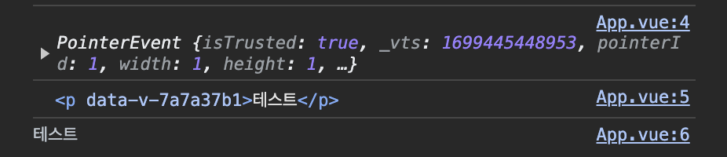
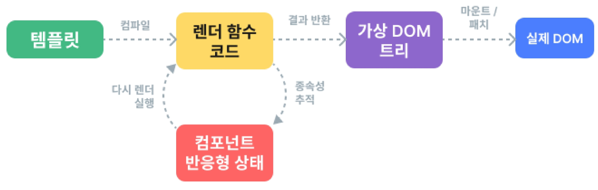
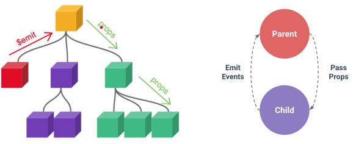
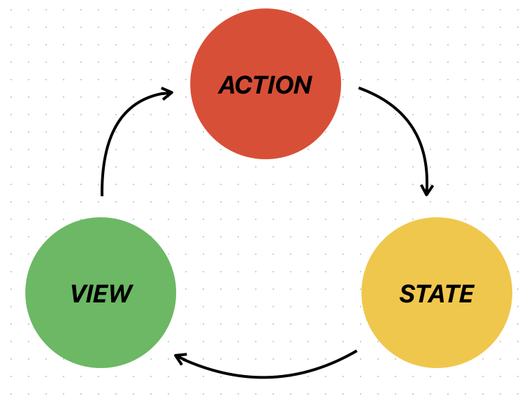
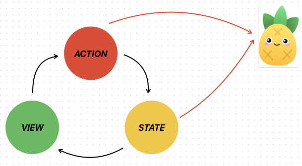

### 🔍# 💡 TOPIC 1 INTRO

#### 김병현

### Single Page Application (SPA)
- 페이지 한 개로 구성된 웹 어플리케이션
- 서버로부터 필요한 모든 정적 HTML을 처음에 한번 가져옴

	ex 페이지 간 이동시, 페이지 갱신에 필요한 데이터만을 JSON으로 전달받아 페이지 일부 갱신

### Client-side Rendering (CSR)
- 브라우저는 페이지에 필요한 최소한의 HTML 페이지와 JavaScript를 다운로드
- JavaScript를 사용하여 DOM을 업데이트 하고 페이지를 렌더링
	- DOM : 텍스트 파일로 만들어진 웹 문서를 브라우저가 이해할 수 있는 구조로 구성하여 메모리에 적재

#### CSR의 장점
1. ***빠른 속도***
	- 페이지의 일부를 렌더링하므로 다른 페이지로 이동하는 것이 빠름
	- 서버로 전송되는 데이터의 양을 최소화
2. 사용자 경험
	- ***새로 고침이 발생 x***
3. Front와 Back의 명확한 분리

#### CSR의 단점
1. ***초기 구동속도가 느림***
	- JavaScript가 다운로드, 구문 분석 및 실행될 때까지 페이지가 완전히 렌더링 되지 않기 때문
2. ***SEO(검색 엔지 최적화)***
	- 페이지를 나중에 그려 나가는 것이기 때문에 검색에 잘 노출이 안됨

## Vue.js

### Vue의 2가지 핵심 기능
1. 선언적 렌더링 (Declarative Rendering)
	- ex : 태그 안에 `{{변수명}}`과 같은 구문을 선언
2. 반응형 (Reactivity)
	- JavaScript 상태 변경사항을 자동으로 추적하고 변경사항이 발생할 때 DOM을 효율적으로 업데이트

### Vue를 사용하는 방법
1. CDN 방식
	- createApp을 통해 새로운 Application instance를 생성
	- .mount()를 통해서 인스턴스를 연결
	- ***mount()는 한 번만 호출할 수 있음***
2. NPM 방식
	- npm create vue@latest 방식

### ref 함수
- 반응형 상태를 선언하는 함수
- 인자를 받아 .value 속성이 있는 ref 객체로 래핑하여 반환
- ref로 선언된 변수의 값이 변경되면, 해당 값을 사용하는 템플릿에서 자동으로 업데이트
- 인자는 어떠한 타입도 가능
- 템플릿의 참조에 접근하려면 setup 함수에서 선언 및 반환 필요
- 템플릿에서 ref를 사용할 때는 .value를 작성할 필요 없음

### 템플릿 렌더링
- Mustache syntax(콧수염 구문)를 사용하여 메시지 값을 기반으로 동적 텍스트를 렌더링
- JavaScript 표현식을 사용할 수 있음
	`<h1>{{message.split('').reverse().join('')}}</h1>`

### 템플릿에서 unwrap
- 템플릿에서의 unwrap은 ref가 최상위 속성인 경우에만 적용가능

```
      <div>{{object.id +1}}</div>			// [object Object]1
      <div>{{object["id"]+1}}</div>			// [object Object]1
      <div>{{object.id}}</div>				// 0
      <div>{{object.id.value}}</div>		// 0
      <div>{{object.id.value + 1}}</div>	// 1
      <div>{{object["id"]}}</div>			// 0
      <div>{{id}}</div>						// 0
      <div>{{id+1}}</div>					// 1

// 그냥 객체를 출력하면 [object Object]가 출력됨

const object = { id: ref(0) };
const { id } = object; //구조분해할당
return { object, id };
```

# 💡 TOPIC 2 Syntax1

#### 김예림, 김병현

## Template Syntax (종류)
1. Text Interpolation <br>
`<p>Message : {{msg}}</p>`
	- 가장 기본적인 형태
	- 콧수염 구문을 사용
	- 해당 구성 요소 인스턴스의 msg 속성 값으로 대체
	- msg 속성이 변경될 때마다 업데이트
2. Raw HTML <br>
HTML - `<div v-html="html"></div>` <br>
Script - `const html = ref("<span>abcd</span>")`
	- 콧수염 구문은 데이터를 일반 텍스트로 해석하기 때문에 실제 HTML을 출력하려면 v-html을 사용해야함.
3. Attribute Bindings <br>
HTML - `<div v-bind:id="dynamicId"></div>` <br>
Script - `const dynamicId = ref('my-id')`
	- 콧수염 구문은 HTML 속성 내에서 사용할 수 없기 때문에 v-bind를 사용
	- 바인딩 값이 null이나 undefind인 경우 렌더링 요소가 제거
4. JavaScript Expressions <br>
`{{number + 1}}`, `{{ok ? 'YES' : 'NO'}}`, `<div :id="'list-${id}'"></div>` <br>
	- Vue는 데이터 바인딩 내에서 JavaScript 표현식의 기능을 지원

***주의 사항***
- 각 바인딩에는 하나의 단일 표현식만 포함 (return 뒤에 사용할 수 있는 코드)

- 작동하지 않는 경우 <br>
	- 표현식이 아닌 선언식 : `{{const number = 1}}`
	- 흐름제어도 작동 x : `{{ if (ok) { return message }}}`
		- 삼항표현식을 사용함 : `{{ok ? message : false}}` 이건 가능

### Directive
- 'v-' 접두사가 있는 특수 속성

`v-text` : `<div v-text="msg"></div>`

`v-html` : html로 표시

`v-show` : 보여줄지 말지

`v-if`, `v-else`, `v-else-if` : if

`v-for` : for

`v-on` : 이벤트 핸들링 @와 같음

`v-bind` : 속성값을 지정할 때 사용 :와 같음

`v-model` : 쌍방향 데이터 바인딩을 만들때 사용

`v-once` : 처음 한번만 렌더링하고 이후에는 안함

## Dynamically data binding(v-bind)

<aside>
💡 하나 이상의 속성 또는 컴포넌트 데이터를 표현식에 동적으로 바인딩

</aside>

### Attribute Bindings

```html

<a :href="myUrl">Move to Url</a>
<p :[dynamicattr]="dynamicValue">동적 바인딩</p>
**<!-- 여기서 :는 v-bind의 약어 -->**
```

✨ 대괄호 안에 작성하는 이름은 반드시 소문자로만 구성 가능

(브라우저가 속성 이름을 소문자로 강제 변환)

### Class and Style Bindings

1. Binding HTML Classes

   - 객체를 :class에 전달하여 클래스를 동적으로 전환할 수 있음

   ```jsx
   const isActive = ref(false);
   // isActive 값에 따라 아래 class에 active의 추가 여부가 결정됨
   ```

   ```html
   <div :class="{active: isActive}">Text</div>
   ```

   - 여러 클래스 전환

   ```jsx
   const isActive = ref(false);
   const hasInfo = ref(true);
   ```

   ```html
   <div class="static" :class="{active: isActive, 'text-primary': hasInfo }">
     Text
   </div>
   ```

   - 객체 방식

   ```jsx
   const isActive = ref(false);
   const hasInfo = ref(true);

   const classObj = ref({
     active: isActive,
     'text-primary': hasInfo,
   });
   ```

   ```html
   <div class="static" :class="classObj">Text</div>
   ```

   - 배열 바인딩

   ```jsx
   const activeClass = ref('active');
   const infoClass = ref('text-primary');
   ```

   ```html
   <div :class="[activeClass, infoClass]">Text</div>
   ```

   - 배열 + 객체

   ```html
   <div :class="[{active: isActive}, infoClass]">Text</div>
   ```

2. Binding Inline Styles

   - inline-style 바인딩 (단, kebab-cased 문자열도 지원 → camelCase 권장)

   ```jsx
   const activeClass = ref('crimson');
   const fontSize = ref(50);
   ```

   ```html
   <div :style="{color: activeColor, fontSize: fontSize + 'px'}">Text</div>
   <div :style="{'font-size': fontSize + 'px'}">Text</div>
   ```

   - Objects에 바인딩, 배열 바인딩 가능

   ```jsx
   const styleObj = ref({
     color: activeColor,
     fontSize: fontSize.value + 'px',
   });
   ```

   ```html
   <div :style="styleObj">Text</div>
   <div :style="[styleObj, styleObj2]">Text</div>
   <!-- 결과 -->
   <div style="color: blue; font-size: 50px; border: 1px solid black;">
     Text
   </div>
   ```

## Event Handling (v-on)

<aside>
💡 DOM 요소에 이벤트 리스너를 연결 및 수신

</aside>

```jsx
v-on:event="handler"
=> @event="handler" // 약어
```

### Handler 종류

1. Inline handlers: 이벤트가 트리거 될 때 실행 될 JS 코드

   주로 간단한 상황에 사용

   ```html
   <button @click="count++">Add 1</button>
   <p>Count: {{ count }}</p>
   ```

2. Method handlers: 컴포넌트에 정의될 메서드 이름

   ✔️ 1번이 불가능한 대부분의 상황에서 사용

   ✔️ Method Handlers를 트리거 하는 기본 DOM Event 객체를 자동을 수신

   ```jsx
   const myFunc = (event) => {
     console.log(event);
     console.log(event.currentTarget);
     console.log(event.target.innerText);
   };
   ```

   ```html
   <p @click="myFunc">테스트</p>
   ```

   

   ✔️ 인자를 전달하여 메서드 호출도 가능

   ```jsx
   const myFunc = (message) => {
     console.log(message);
   };
   ```

   ```html
   <p @click="myFunc('test')">테스트</p>
   ```

   ✔️ 인자와 이벤트 객체 모두 사용하고 싶다면 ? **($event 사용)**

   ```jsx
   const myFunc = (message, event) => {
     console.log(message);
     console.log(message);
   };
   ```

   ```html
   <p @click="myFunc('test', $event)">테스트</p>
   ```

### Event Modifiers

.stop, .prevent, .self, .capture, .once, .passive

```jsx
<!-- 클릭 이벤트 전파가 중지됩니다. -->
<a @click.stop="doThis"></a>

<!-- submit 이벤트가 더 이상 페이지 리로드하지 않습니다. -->
<form @submit.prevent="onSubmit"></form>

<!-- 수식어를 연결할 수 있습니다. -->
<a @click.stop.prevent="doThat"></a>

<!-- 이벤트에 핸들러 없이 수식어만 사용할 수 있습니다. -->
<form @submit.prevent></form>

<!-- event.target이 엘리먼트 자신일 경우에만 핸들러가 실행됩니다. -->
<!-- 예를 들어 자식 엘리먼트에서 클릭 액션이 있으면 핸들러가 실행되지 않습니다. -->
<div @click.self="doThat">...</div>

<!-- 이벤트 리스너를 추가할 때 캡처 모드 사용 -->
<!-- 내부 엘리먼트에서 클릭 이벤트 핸들러가 실행되기 전에, 여기에서 먼저 핸들러가 실행됩니다. -->
<div @click.capture="doThis">...</div>

<!-- 클릭 이벤트는 단 한 번만 실행됩니다. -->
<a @click.once="doThis"></a>

<!-- 핸들러 내 `event.preventDefault()`가 포함되었더라도 -->
<!-- 스크롤 이벤트의 기본 동작(스크롤)이 발생합니다.        -->
<!-- 모바일 장치의 성능 향상을 위해 터치 이벤트 리스너와 함께 사용 -->
<div @scroll.passive="onScroll">...</div>
```

```html
<form @submit.prevent="onSubmit"></form>
```

**❌ 유의할 점**

1. vue에서 v-on에 대한 Event Modifiers를 제공하기 때문에 event.preventDefault()와 같은 구문을 메서드에서 작성하지 말 것
2. Modifiers는 chained 되게끔 작성할 수 있으며 작성된 순서로 실행되기 때문에 작성 순서에 유의할 것

### Key Modifiers

키보드 이벤트를 수신할 때 특정 키에 관한 별도 modifiers를 사용가능

```html
<input @keyup.enter="onSubmit" />
```

## Form Input Bindings

form을 처리할 때 사용자가 input에 입력하는 값을 실시간으로 JavaScript 상태에 동기화 해야하는 경우 ⇒ **양방향 바인딩**

### 1. v-bind와 v-on을 함께 사용

@input과 :value를 함께 사용

v-bind를 사용하여 input요소의 value 속성 값을 입력값으로 사용,

v-on을 사용하여 input 이벤트가 발생할 때마다 input의 value 값을 별도 반응형 변수에 저장하는 핸들러 onInput을 호출

```jsx
const inputText1 = ref('');
const **onInput** = (event) = {
	inputText1.value = event.currentTarget.value;
};
```

```html
<p>{{ inputText1 }}</p>
<input **:value="inputText1" @input="onInput" ** />
```

✨ IME(입력기)가 필요한 언어(한국어, 중국어, 일본어)의 경우 v-model이 제대로 업데이트 되지 않아서 v-bind와 v-on을 사용해야 함

### 2. v-model 사용

v-model을 사용하여 사용자 입력 데이터와 반응형 변수를 실시간 동기화

```jsx
const **inputText2** = ref('');
```

```html
<p>{{ inputText2 }}</p>
<input **v-model="inputText2" ** />
```

✔️ checkbox 활용했을 때

1. 단일

```html
<input type="checkbox" id="checkbox" **v-model="checked" ** />
<label for="checkbox">{{ checked }}</label>
```

1. 여러개 활용

```jsx
const checkedNames = ref([]);
```

```html
<input type="checkbox" id="alice" value="Alice" **v-model="checkedNames" ** />
<label for="alice">Alice</label>
<input type="checkbox" id="bella" value="Bella" **v-model="checkedNames" ** />
<label for="bella">Bella</label>
```

✔️ select 활용했을 때

초기 값이 어떤 option과도 일치하지 않을 때, “선택되지 않은(unselected)”상태로 렌더링

```jsx
const selected = ref('');
```

```html
<div>Selected: {{ selected }}</div>

<select v-model="selected">
  <option disabled value="">Please select one</option>
  <option>Alice</option>
  <option>Bella</option>
  <option>Cathy</option>
</select>
```

# 💡 TOPIC 3 Syntax2

#### 석지명

# Basic Syntax 2

## Computed vs Method vs Watch

#### Computed

- 계산된 속성을 정의하는 함수
    - 미리 계산 => 캐싱 => 리렌더링 시 함수 재등록x
    - 데이터 변환 자동 감지O, 종속된 데이터가 변경될 때만 함수를 실행
    - 이벤트 함수 자리 X
    - getter computed 함수는 반드시 값을 return

#### Method

- 일반적인 함수
    - 리렌더링 시 재등록O (호출 시에만 실행)
    - 데이터 변환 감지X
    - 이벤트 함수 자리 O


#### Watch
    
- 감시, 추적용
    - 리렌더링 시 재등록O
    - 데이터 변환 자동 감지O
    - 이벤트 함수 자리 X
    - 개발자가 코드 상에서 직접 해당 함수를 호출하는게 아니기 때문에, 호출된 return값을 
    알 수도 없고 딱히 쓸 일도 없다.


#### 어떻게 구분해서 사용해야 하나?


❓ 컴포넌트가 리랜더링 될 때마다 함수가 등록되는가?

method O / computed X / watch O

❓ 특정한 값 data가 변환되는것을 감지 하는가?

method X / computed O / watch O

❓ 함수를 이벤트 함수 자리에 등록할 수 있는가?

method O / computed X / watch X

#### Computed vs Method

- 접근 방식은 동일
    - computed 속성은 종속 대상을 따라 저장(캐싱)된다
    - 메소드는 호출하면 렌더링을 다시 할 때마다 항상 함수를 실행


#### Computed vs Watch

공통점 : 둘 다 데이터 값에 변경이 일어나는지 감시하고, 변경될 때마다 정의된 함수가 실행됨

차이점 :

Computed는 모든 변수를 감시할 수 있다
Watch는 각 변수에 대한 result값을 일일이 찍어내야 한다.
computed는 그럴 필요가 없이 그냥 묶어서 한줄컷 가능하므로, 반복되는 코드를 하나로 통합시킬 수 있다는 장점.

```javascript
<!DOCTYPE html>
<html lang="en">
<head>
    <meta charset="UTF-8">
    <title>Title</title>
    <script src="https://unpkg.com/vue@3/dist/vue.global.js"></script>
    <script>
        window.onload = function(){
            var vm1 = new Vue({
                el : '#test1',
                data : {
                    data1 : 'aaa',
                    data2 : 'bbb',
                    result1 : ''
                },
                watch : {
                    data1 : function(){
                        this.result1 = 'data1 : ' + this.data1 + ',data2 : ' + this.data2
                        //어 그런데 data2는 계속 실시간으로 변경이 안되는 이유 무엇? : data2에 watch를 셋팅하지 않아서
                    },
                    data2 : function(){
                        this.result1 = 'data1 : ' + this.data1 + ',data2 : ' + this.data2
                    }
                },
                computed : {    //모든 변수를 감시 가능 - 반복된 코드를 하나로 통합가능
                    result2 : function(){
                        return 'data1 : ' + this.data1 + ', data2 : ' + this.data2
                    }
                }
            })
        }
    </script>
</head>
<body>
    <div id = 'test1'>
        <input type = 'text' v-model = 'data1'/><br/>
        <input type = 'text' v-model = 'data2'/><br/>
        <h3>result1</h3>
        <div>{{result1}}</div>
        <h3>result2</h3>
        <div>{{result2}}</div>
    </div>
</body>
</html>
```

watch가 computed는 매우 비슷한 역할을 수행할 수 있지만, 사용되는 용도에 차이가 있다
- computed : 이미 정의된 계산식에 따라 결과값을 반환할 때 사용
    computed의 경우 종속관계가 복잡할 수록 재계산 시점을 예상하기 힘들기 떄문에 종속관계의 값으로 계산된 결과를 리턴하는 것 외의 사이드 이펙트가 일어나는 코드를 지양해야한다. HTTP 통신과 같이 컴퓨팅 리소스가 많이 필요한 로직을 정의X
- watch : 어떤 특정 조건에서 함수를 실행시키기 위한 트리거로서 사용
    - 상태 변경에 대한 반응으로 "사이드 이펙트"(예: DOM을 변경하거나 비동기 작업의 결과를 기반으로 다른 상태를 변경하는 것)를 수행할 때
    - watch의 경우 데이터 변경의 응답으로 비동기식 계산이 필요한 경우나, 시간이 많이 소요되는 계산을 해야할 때 사용하는 것이 유용하며, 데이터 변경시 특정  특정 함수를 실행하는 트리거로 사용한다.

<hr>

#### 주의사항

- computed의 반환값을 변경하면 안된다

- computed 사용 시 원본 배열을 변경해서는 안된다
    - 원본을 변경하면 데이터 변화를 감지할 수 없다 
    

## v-if vs v-show (Conditional Rendering)

공통점 : 
    - directive이므로 단일 요소에만 연결 가능 => 여러 요소에 쓰고 싶으면 상위 태그 만들어서 넣기
    - 최상위 root에는 사용 불가

- v-if : T/F 기반으로 요소를 조건부 렌더링(DOM 구조 변경)
    - 처음에 조건에 맞는 것만 구성 => 초기 비용이 크지 않다
    - 조건이 바뀌면 DOM 구조 자체를 변경 => 렌더링 비용이 크다
        => 변경이 자주 일어나지 않는 곳(예시:로그인 상태 여부)에 사용

- v-show : T/F 기반으로 요소의 가시성(visibility) 전환 (style값 변경)
    - T/F에 관계없이 일단 DOM구성 => 초기 비용이 크다
    - 값 변경시 style의 display 속성만 변경 => 렌더링 비용이 적다
        => 변경이 자주 일어나는 곳에 적합


## v-for (List Rendering)

- 소스 데이터(Array, Object, number, string, Iterable)를 기반으로 요소 또는 템플릿 블록을 여러 번 렌더링
    - alias(별칭) 제공 / 인덱스, 키 에 대한 별칭 지정 가능
    - 여러 요소는 template 요소로 묶어서
    - v-for 끼리 중첩 가능
    - v-for는 반드시 key와 함께 사용
        - 내부 컴포넌트의 상태를 일관되게 유지
        - 데이터의 예측 가능한 행동을 유지

        => Vue는 메모리를 최적화하기 위해 DOM을 재사용하므로
        바뀌어야될 DOM부분만 처리한다. 만약에 랜더링한 배열의 순서가 바뀐다면,
        변경된 부분에 대해서만 patch가 일어나므로, 랜더링한 배열의 순서가 새로운 배열의 순서대로 랜더링이 일어나지 않는다.
        따라서 key와 v-for를 바인딩 해주어야 한다.

    - 동일한 요소에 v-for와 v-if를 함께 사용하지 않는다
        - 우선순위는 v-if가 v-for보다 높다 (예시)
        - v-if 조건은 v-for범위의 변수에 접근할 수 없다.(우선순위)


```javascript
<template>
    <ul>
        <li v-for="todo in todos" v-if="todo.isComplete === true" : key="todo.id">
            {{todo.name}}
        </li>
    </ul>
</template>

<script setup>
let id = 0;

const todos = ref([
    {id: id++, name: '복습', isComplete:true},
    {id: id++, name: '예습', isComplete:false},
    {id: id++, name: '스터디', isComplete:true},
    {id: id++, name: '알고리즘', isComplete:false},
])
</script>
```

## Lifecycle Hooks

- Vue 인스턴스
    - Vue를 구성하난 가장 기본적인 베이스이며 객체
    - 라이프사이클을 시작점으로 여러 동작들의 초기화 작업을 수행

- Vue 인스턴스의 생애주기 동안 특정 시점에 실행되는 함수
- 개발자가 특정 단계에서 의도하는 로직이 실행될 수 있도록 함
- Vue는 Lifecycle Hooks에 등록된 콜백 함수들을 인스턴스와 자동으로 연결함
- Hooks 함수들은 반드시 동기적으로 작성
- 인스턴스 생애 주기의 여러 단계에서 호출되는 다른 Hooks도 있다


#### 종류
- onMounted(() => { })

```javascript
import { onMounted } from 'vue'

export default {
  setup() {
    // onMounted() 훅은 setup 함수 내에서 사용하는 경우에만
    // 마치 외부의 함수를 호출한 것처럼 작성할 수 있습니다.
    //
    // 이렇게 작성된 onMounted() 훅은
    // 컴포넌트가 마운트 된 이후 콜백 함수를 실행하지만
    // `this`를 통해 컴포넌트 인스턴스에 접근할 수 없습니다.
    onMounted(function() {
      // `this`를 통해 컴포넌트 인스턴스에 접근할 수 없습니다.
      console.log('onMounted가 호출 되었습니다:', this)
    })
  },

  // 컴포넌트가 마운트 된 후,
  // 옵션 API 방식의 mounted() 훅을 실행.
  mounted() {
    // `this`를 통해 컴포넌트 인스턴스에 접근할 수 있습니다.
    console.log('mounted()가 호출 되었습니다:', this)
  }
}

```


- onUpdated(() => { })
- onUnmounted(() => { })

## Vue Style Guide

- Vue 스타일 가이드 규칙 => 우선순위에 따라 4가지 범주
    - A : 필수 / 오류 방지, 꼭 학습 및 준수
        - v-for에 key 작성(또한 배열의 인덱스를 v-for의 key로 사용x)
        - 동일 요소에 v-if 와 v-for를 함께 사용하지 않기
    - B : 적극권장 / 가독성, 개발자 경험, 규칙 위반시 정당한 사유가 있어야
    - C : 권장 / 일관성 보장용
    - D : 주의 필요 / 잠재적 위험 특성을 고려

- 원본 배열 수정 메서드
    -push(), pop(), shift(), unshift(), splice(), sort(), reverse()

- 복사 메서드
    - filter(), concat(), slice()

- v-for와 배열의 필터링/정렬결과 표시
    -
    -
    -

# 💡 TOPIC 4 SFC

#### 김종인

## Single-File Components
- **Component**
  - Component란 하나의 덩어리로서, 재사용 가능한 코드 블록을 의미한다.
  - UI를 독립적이고 재사용 가능한 일부분으로 분할하고 각 부분을 개별적으로 다룰 수 있음. 이에 따라 앱은 자연스럽게 중첩된 Component의 트리로 구성된다.
- **Single-FIle Component (SFC)**
  - 컴포넌트의 템플릿, 로직 및 스타일을 하나의 파일로 묶어낸 특수한 파일 형식 (*.vue 파일)
  - template에서 HTML을, scrpit에서 JS와 Vue 인스턴스를 style에서 CSS를 하나의 파일에서 컴포넌트의 뷰, 로직 및 스타일을 캡슐화하고 배치

### 🔍 Single-File Components 문법
- **최상위 언어 블록**
  - template, script, style이며 일반적으로 해당 순서로 작성
  -  *.vue 파일은 template, script setup의 경우 단 1개의 태그만 포함할 수 있지만 style의 경우 여러 태그가 포함될 수 있다.
- **template**
  - 예를 들어, template 안에 div 태그가 2개 오는 경우가 있는데 현재 vue3 버전에서는 오류가 발생하지는 않지만 권장하지 않음. (vue2는 오류 발생)
  - template 태그는 렌더링 되지 않고 사라진다.
- **script setup**
  - 컴포넌트의 setup() 함수로 사용되며 컴포넌트의 각 인스턴스에 대해 실행함
    - setup()을 통해서 return을 해주는 경우에서는 모든 코드에 대해 return을 작성하는 불편함이 있었다.
- **style scoped**
  - scoped가 지정되면 CSS는 현재 컴포넌트에만 적용 (scoped가 없다면 다른 컴포넌트에도 적용되므로 주의!)

## SFC build tool (Vite)
- 프론트엔드 개발 툴 (Vue에만 한정하지 않음)
- node.js를 설치해서 npm을 사용할 수 있음.
- 우리가 이후에 router를 배우면서 SPA(Single Page Application) -> 여러 페이지로 갈 수 있음.

### 🔍 Node.js
- 정의: Chrome의 V8 JavaScrpit 엔진을 기반으로 하는 Server-Side 실행환경
- 영향
  - 기존에 브라우저 안에서만 동작할 수 있었던 JavaScript를 브라우저가 아닌 서버 측에서도 실행할 수 있게 함
    - 프론트 엔드와 백엔드에서 동일한 언어로 개발 할 수 있게 됨
  - NPM(Node Package Manager)을 활용해 수많은 오픈 소스 패키지와 라이브러리를 제공하여 개발자들이 손쉽게 코드를 공유하고 재사용할 수 있게 함

### 🔍 Vite 프로젝트 구조
- **node_modules**
  - 외부 패키지들이 저장되는 디렉토리
  - 프로젝트의 의존성 모듈을 저장하고 관리하는 공간
  - node_modules 파일은 .gitignore에 작성되기 때문에 공유가 되지 않는다.
- **package-lock.json**
  - node_modules에 들어있거나 해당 프로제트의 정보를 저장하는 파일
    - 예를 들어, 이전에 A라는 사람이 axios 1버전을 사용하여 작업했으나 이후에 B라는 사람이 axios 3버전을 이용해서 작업하면 버전이 달라 의존 관계 등 동작이 제대로 되지 않을 수 있는 현상을 방지한다.
    - 정확한 버전 보장, 일관성 있는 의존성 유지로 패키지 설치에 필요한 모든 정보를 포함
- **public 디렉토리**
  - 정적 파일 위치 (참조되지 않는 소스 코드, 같은 이름을 갖고 import할 필요 없는 파일)
  - 항상 root 절대 경로를 사용하여 참조
- **src 디렉토리**
  - 주요 소스 코드를 포함하는 곳
  - 컴포넌트, 스타일, 라우팅 등 프로젝트의 핵심 코드 관리
  - assets
    - 이미지, 폰트, 스타일 시트 등을 관리하며 컴포넌트 자체에서 참조하는 내부 파일을 저장하는데 사용 (우리가 삭제하는 base.css, logo.svg, main.css 등)
  - components
    - Vue 컴포넌트를 작성하는 곳 (SFC 파일들을 저장하는 폴더), App.vue는 components 폴더 내에 포함되어 있지 않음.
  - App.vue
    - Vue 앱의 최상위 Root 컴포넌트로 다른 하위 컴포넌트들을 포함하며 어플리케이션 전체의 레이아웃과 공통적인 요소를 정의
  - main.js
    - Vue 인스턴스를 생성하고, 어플리케이션을 초기화 하는 역할로서 필요한 라이브러리를 import하고 전역 설정을 수행하는 역할을 한다.
  - index.html
    - Root 컴포넌트인 App.vue가 해당 페이지에 마운트 되기 때문에 Vue 앱이 SPA인 이유이다. (index.html 파일이 1개밖에 없어서)
    - Vue 앱의 기본 HTML 파일, 앱의 진입점, 필요한 스타일 시트 및 스크립트 등의 외부 리소스를 로드할 수 있음.

## Virtual DOM

### 🔍 Virtual DOM의 정의
- 웹 성능 향상을 위한 Vue의 렌더링 기술로 실제 DOM과 변경 사항 비교를 통해 변경된 부분만 실제 DOM에 적용하는 방식
- 실제 DOM을 조작하는 것은 느리지만 가상 DOM을 조작하는 것은 빠르다.


### 🔍 Virtual DOM의 장점
- **효율성**
  - 실제 DOM 조작을 최소화 하고, 변경된 부분만 업데이트 (성능 향상)
- **반응성**
  - 데이터의 변경을 감지(Watch, Computed), Virtual DOM을 효율적으로 갱신하여 UI를 자동으로 업데이트
    - Computed : 나와 직접적으로 관련되어 있는 것이 값이 변화가 생긴다면 바뀐 값으로 변화를 시켜주고 캐싱을 하고있다. (데이터가 바뀌지 않으면 이미 내가 저장한 값이 있으니 다시 계산을 하지 않음)
    - watch : 나와 직접적으로 관련되어 있거나 아닌 것들을 감시하
- **추상화**
  - 조작은 Vue가 개발자는 실제 DOM 조작만 진행

### 🔍 Virtual DOM 주의사항
- 실제 DOM에 직접 접근하지 말 것 (직접 접근이 필요한 경우는 ref를 통해서 할 것)
  - querySelector 대신 bind 또는 변수를 선언하거나 addEventListener 대신 v-on(@)을 통해 이벤트 감지한다.

### 🔍 Virtual DOM 주의사항
- **Composition API** (규모가 있는 프로젝트) -> 권장
  - script setup 안에 한 곳에 변수나 메서드를 한 곳에서 모아서 사용
- **Option API** (복잡성이 낮은 프로젝트)
  - data 안에 변수 선언, methods 안에 메서드 선언, mounted를 통해 컴포넌트를 정의함
  - Option API의 경우에는 변수와 메서드가 분리되서 선언되기 때문에 코드가 길 경우에 해당 메서드의 변수가 어떤 것인지 확인하는데 어려움이 있다.

## 참고
- Scaffolding (스캐폴딩) : 초기구조와 기본 코드를 자동으로 생성
- scoped 기능 : 부모컴포넌트의 스타일이 자식 컴포넌트로 유출되지 않음
  - scoped 예시
```Vue
<!-- App.vue-->
<template>
  <h1>App.vue</h1>
  <MyComponent />
</template>

<style scoped>
div {
  color: red'
}
</style>
```

```Vue
<!-- MyComponent.vue-->
<template>
  <div>
    <h2>MyComponent</h2>
  </div>
</template>
```
위의 경우, MyComponent는 App.vue의 자식으로서 부모와 본인의 CSS 모두 영향을 받기 때문에 글자색이 red이다.

# 💡 TOPIC 5 STATE

#### 이승헌
## Component State Flow

- Passing Props : 부모 -> 자식 데이터 전달
- Component Event(Emit Event) : 자식 -> 부모 응애 일어난 일 알림
----
### 🔍 1. Passing Props
- Props : 부모 컴포넌트 -> 자식 컴포넌트 데이터를 전달하는데 사용되는 속성

- 모든 props는 자식 속성과 부모 속성 사이에 하향식 단방향 바인딩을 형성한다.(one-way-down binding)
    - 하위 컴포넌트가 실수로 상위 컴포넌트의 상태를 변경하여 앱에서의 데이터 흐름을 이해하기 어렵게 만드는 것을 방지하기 위해 단방향 바인딩
    - 하위에서 막 변경하면 데이터 꼬일까봐 막아둔거임

- 특징
    - 부모 속성이 업데이트되면 자식으로 흐르지만 그 반대는 안됨
        - 자식 컴포넌트 내부에서 props를 변경 시도해서는 안되며 불가능

    - 부모 컴포넌트가 업데이트 될 때마다 자식 컴포넌트의 모든 props가 최신 값으로 업데이트
        - 부모 컴포넌트에서만 변경하고 이를 내려 받는 자식 컴포넌트는 자연스럽게 갱신

<br>

- props 선언 방식
    - 문자열 배열을 사용한 선언
        - defineProps()를 사용하여 props 선언
        ``` jsx
        <!-- 자식 -->
        defineProps(['myMsg'])
        ```
    - 객체를 사용한 선언(권장)
        - 객체 선언 문법의 각 객체 속성의 키는 props의 이름이 되며, 객체 속성의 값이 될 데이터의 타입에 해당하는 생성자 함수(Number, String ..) 이어야함.
        ```jsx
        <!-- 자식 -->
        defineProps({
                        myMsg: String
                    })
        ```

<br>

- props 데이터 사용
    - 템플릿에서 반응형 변수와 같은 방식
    ```html
    <!-- 자식 -->
    <p>{{ myMsg }}</p>
    ```
    - props를 객체로 반환하므로 필요한 경우 JavaScript에서 접근 가능 ```console.log(props.myMsg)```

<br>

- Props Name Casing
    - 선언 및 템플릿 참조 = camelCase
    ``` html
    <p>{{ myMsg }}</p>
    ```
    - 자식 컴포넌트 전달 = kebab-case
    ```jsx
    <ParentChild my-msg="message"/>
    ```

<br>

- Static & Dynamic
    - 변수 선언할 때 앞에 ref
    ```jsx
    <!-- 부모 -->
    <script setup> 
        import { ref } from 'vue'
        const name = ref('영섭')
    </script>
    ```
    - 전달 v-bind 사용 ( : )
    ```html
    <!-- 부모 -->
    <!-- ParentChild에 message 보내기 -->
    <ParentChild :my-msg="message">
    ```  

---


### 🔍 2. Component Events

- 자식이 Emit으로 발신, 부모가 v-on으로 수신
- Emit event : 자식은 일어난 일을 부모에게 알려 부모가 prop데이터 변경하도록 요청
- $emit()
    - 자식 컴포넌트가 이벤트 발생시켜 부모 컴포넌트로 데이터 전달하는 역할
    - '$'로 Vue 인스턴스나 컴포넌트 내에서 제공되는 전역 속성이나 메서드 식별
    - $emit(event, ...args)

<br>

- 이벤트 발신 및 수신
    1. 자식이 $emit으로 표현식에서 직접 발신(someEvent라는 사용자 정의 이벤트)
    ```html
    <!-- 자식 -->
    <button @click="$emit('someEvent')">클릭</button>
    ```
    2. 부모가 v-on으로 이벤트 수신
        - 수신 후 처리할 로직 및 콜백함수 호출(someEvent를 받아서 someCallback 호출)
    ```html
    <!-- 부모 -->
    <ParentChild @some-event="someCallback" />
    ```
    ```jsx
    <!-- 부모 -->
    const someCallback = function () {
        console.log('부모는 잘 받았다 자식아')
    }
    ```
<br>

- emit 이벤트 선언
    - difineEmits()로 발신할 이벤트 선언
    - script에서 $emit 메서드 접근 불가이기에 difineEmits()는 $emit 대신 사용할 동등한 함수 반환
    ```html
    <!-- 자식 -->
    <button @click="buttonClick">클릭</button>
    ```
    ```jsx
    <!-- 자식 -->
    <script setup>
    const emit = defineEmits(['someEvent'])

    const buttonClick = function () {
        emit('someEvent')
    }
    </script>
    ```

<br>

- 이벤트 인자 전달
    - 자식 발신
    ```html
    <!-- 자식 -->
    <button @click="emitArgs">추가 인자 전달</button>
    ```
    ```jsx
    <!-- 자식 -->
    const emit = defineEmits(['emitArgs'])

    const emitArgs = function () {
        emit('emitArgs', 1, 2, 3)
    }
    ```
    - 부모 수신
    ```html
    <!-- 부모 -->
    <ParentChild @emit-args="getNumbers" />
    ```
    ```jsx
    <!-- 부모 -->
    const getNumbers = function (...args){
        console.log(args)  // -> [1, 2, 3] 출력
        console.log(`추가인자 ${args}를 수신`)  // 추가인자 1,2,3를 수신 출력
    }
    ```
- Event Name Casing
    - 선언 및 발신 -> camelCase
    ```html
    <!-- 자식 -->
    <button @click="$emit('someEvent')">클릭</button>
    ```
    ```jsx
    const emit = defineEmits(['someEvent'])

    const buttonClick = function () {
        emit('someEvent')
    }
    ```
    - 부모가 수신 -> kebab-case
    ```html
    <ParentChild @some-event="..." />
    ```
----

# 💡 TOPIC 6 라우터

#### 조현수

### 🔍 Routing

네트워크에서 경로를 선택하는 프로세스. 웹 어플리케이션에서 다른 페이지 간의 전환과 경로를 관리하는 기술

1. **SSR (Server Side Rendering)**
   - 서버에서 사용자에게 보여줄 페이지를 모두 구성하여 사용자에게 페이지를 보여주는 방식 (JSP, Servlet)
2. **CSR (Client Side Rendering)**
   - 처음 로드될때 전체 페이지를 다 받아온 후에, 클라이언트 측에서 필요한 컴포넌트를 랜더링 하는 방식. 즉 페이지는 한 개이지만 링크에 따라 여러 컴포넌트를 랜더링 하여 마치 여러 페이지를 사용하는 것처럼 구성한다.
3. **SPA ( Single Page Application)**
   - 서버로부터 새로운 페이지를 불러오지 않고 페이지를 동적으로 불러와서 사용하는 웹어플리케이션

### 🔍 RouterLink

- 페이지를 로드하지 않고 URL을 변경하는 로직 처리
- HTML의 a태그를 렌더링

```html
<template>
    <nav>
        <RouterLink to="/" > Home <RouterLink>
        <RouterLink to="/about" > About <RouterLink>
    </nav>
</template>

```

### 🔍 RouterView

- URL에 해당하는 컴포넌트를 표시
- 원하는 레이아웃에 배치
- views폴더에 RouterView 위치에 렌더링 할 컴포넌트를 배치
- 일반 컴포넌트와 구분하기 위해 이름을 View로 끝나도록 작성

```html
<template>
    <nav>
        <RouterLink to="/" > Home <RouterLink>
        <RouterLink to="/about" > About <RouterLink>
        <RouterLink :to="{name: 'home'}" > Home <RouterLink>
        <RouterLink :to="{name: 'about'}" > About <RouterLink>
        <RouterLink :to="{name: 'user', params:{id: 'ssafy'}}"김싸피</RouterLink>
    </nav>

    <!-- 페이지를 렌더링 하고 싶은 곳에 배치-->
    <RouterView/>
</template>

<script setup>
    import { RouterView, RouterLink } from 'vue-router';

</script>
```

### 🔍 Router 활용

### index.js

```js
import HomeView from '../views/HomeView.vue';
import AboutView from '@/views/AboutView.vue';
import UserView from '@/views/UserView.vue';

const router = createRouter({
  routes: [
    //HomeView
    {
      path: '/',
      name: 'home',
      component: HomeView,
    },
    //AboutView
    {
      path: '/about',
      name: 'about',
      component: AboutView,
    },
    //UserView - 동적 경로 매칭
    {
      path: '/user/:id', //매개변수 표시
      name: 'user',
      component: UserView,
    },
  ],
});
```

### UserView.vue

```html
<template>
    <div>
        <h1>UserView<h1>
        <!--첫번째 방법 : $route.params로 참조-->
        <!-- 추천 하지 않음 -->
        {{$route.params.id}}

        <!--두번째 방법-->
        <!-- 이와 같이 작성 권장-->
        <!-- Composition API 방식-->
        {{userId}}
    </div>
</template>

<script setup>
    import {ref} from 'vue'

    //router를 적용하기 위한 설정
    import {useRoute} from 'vue-router'

    const route = useRoute()

    //route.params.id의 값을 ref변수 userId에 담아서 template 영역과 동적 경로 매칭
    const userId = ref(route.params.id)
</script>

```

### 🔍 프로그래밍 방식 네비게이션

1. router.push() -> 다른 위치로 이동
2. router.replace() -> 현재 위치 바꾸기

### router.push()

- 다른 URL로 이동
- **새 항목을 history stack에 push하는 방식 -> 브라우저 뒤로가기 버튼 클릭시 이전 URL로 이동 가넝**
- RouterLink 클릭할 때 내부적으로 호출되는 메서드이므로 동일한 방식

선언적 : `<RouterLink :to=""/>`

프로그래밍적 : `router.push(...)`

```html
<template>
    <div>
        <h1>UserView<h1>

        <button @click="goHome">홈으로</button>
    </div>
</template>

<script setup>
    //router를 적용하기 위한 설정
    import {useRouter} from 'vue-router'

    const router = useRouter()

    const goHome = function(){
        router.push("/home")            // path 방식
        router.push({name: 'home'}) // name 방식
        router.push({name: 'user', params: {username: 'ssafy'}}) // 인자 넘길 때
    }
</script>

```

### router.replace()

- push 메서드와 달리 history stack에 새로운 항목을 push 하는 것이 아니라 다른 URL로 이동
- **뒤로가기가 불가능**
- 선언적 : `<RouterLink : to="" replace>`

프로그래밍적: `router.replace(...)`

### 🔍 Navigation Guard

Vue router를 통해 특정 URL에 접근할 때 다른 URL로 redirect를 하거나 취소하여 Navigation을 보호하는 역할
ex. 인증 정보가 없으면 특정 페이지에 접근 불가능(약간 인터셉터 느낌)

1. **Globally(전역 가드)**
   - 어플리케이션 전역에서 동작
   - index.js에 정의
2. **Per-route(라우터 가드)**
   - 특정 route에서만 동작
   - index.js의 각 routes에 정의
3. **In-component(컴포넌트 가드)**
   - 특정 컴포넌트에서만 동작
   - 컴포넌트 script에 정의

### Globally Guard

1. router.beforeEach()

- 다른 URL로 이동하기 직전에 실행
- to : 이동할 정보가 담긴 Route 객체
- from : 현재 URL 정보가 담긴 Route 객체
- return false : 현재 네비게이션을 취소
- return {name: 'About'} : router.push() 처럼 다른 위치로 redirect
- return 이 없으면 'to' URL Route객체로 이동
- index.js에 정의

```js
router.beforeEach((to, from) => {
  //로직
  return false;
});
```

### Per-route Guard

2. router.beforeEnter()

- route에 진입했을 때만 실행되는 함수
- 매개변수, 쿼리 값이 변경 될 때는 실행되지 않고, 다른 경로에서 탐색할 때만 실행
- 함수의 to, from 선택 반환 인자는 beforeEach와 동일
- routes 객체에 정의

### 컴포넌트 가드

3. onBeforeRouteLeave

- 현재 라우트에서 다른 라우트로 이동하기 전에 실행
- 사용자가 현재 페이지를 떠나는 동작에 대한 로직을 처리

4. onBeforeRouteUpdate

- 이미 렌더링된 컴포넌트가 같은 라우트 내에서 업데이트 되기 전에 실행
- 라우트 업데이트 시 추가적인 로직을 처리

### 🔍 Lazy Loading Routes (참고)

```js
path: '/about',
name: 'about',
component: () => import('../views/AboutView.vue')
```

- 첫 빌드시 해당 컴포넌트를 로드하지 않고, 해당 경로를 처음 방문할 때만 컴포넌트를 로드
- 앱을 빌드할 때 앱의 크기에 따라 페이지 로드 시간이 길어질 수 있기 때문에 활용

# 💡 TOPIC 7 상태관리

#### 김영섭

### 🔍 상태관리 (State Management)

- 상태(State) == 앱 구동에 필요한 Data
- 뷰(View) == 상태 선언적 매핑, 시각화 (위에서 보여주는 template)
- 기능(Action) == 사용자 Input에 따라 뷰에서 상태 변경. (function과 비슷)
- Vue 컴포넌트는 이미 반응형 상태를 관리한다. (ref() ...)



- 기능(Action)은 상태(State)를 변경. 상태(State)는 뷰를 변경. 뷰는 기능(Action)을 변경하는 단방향 데이터흐름.

### 🔍 상태 관리의 단순성 붕괴
- 프로젝트 사이즈가 커지고, 컴포넌트와 뷰 개수가 늘어나면 복잡.
- 여러 컴포넌트가 나의 상태(State, Data)를 공유한다면?
- 공유 상태를 공통 조상에 끌어올려서 Props 로 목적지까지 전달-전달
- 혹은 서로 다른 뷰가 동일한 상태(State)를 변경해야 한다면?
- 그럼 또 다른 뷰도 변경하고 동기화해줘야 한다.
- 당연히 계층 구조가 깊어질수록 **몹시 비효율적**이다.
- 유지 보수 관리 어렵

### 🔍 해결책 
- 전체 컴포넌트들의 공유 상태를 추출해서 전역에서 참조할 수 있는 저장소에 저장, 관리해야 한다.
- 전체 컴포넌트 트리는 하나의 거대한 View가 된다. 계층 구조와 무관하게 State, Action을 사용할 수 있도록. 
- 이를 위해서 Pinia를 사용한다.
- 그렇다고 해서 모든 State와 Action을 Pinia가 전담하게 하면 안된다. 각 Data와 Func에 따라서 ...
- (Action과 State를 Pinia Library가 대신 해준다. ~~귀엽다~~)


### 🔍 Pinia 
- **Vue 공식 지원 저장소 라이브러리**
- Pinia 구성요소 5가지
    - Store : 중앙 저장소 
        - 모든 컴포넌트가 공유하는 상태, 기능 작성
        - **여러 개 만들 수 있다** 여러 JS 파일로
    - State : 반응형 Data (ref()...)
    - Getters : 계산된 값 (computed()...)
        - store 속 state처럼 직접 접근이 가능하다.
    - Setters : 메서드 (function()...)
    - Plugin : 상태관리에 필요한 추가 기능 제공 모듈
    - 중앙 저장소와 localStorage 일치시키는 플러그인을 수업에서 사용했었음.
    - store 이름 작명시 prefix: use, suffix: Store로 작명해줄 것
        - ex/ useCounterStore

- Pinia 언제 사용해야 할까?
    - Pinia 는 공유된 상태를 관리하는데 유용하지만, 시작 비용이 크다.
    - Application이 단순하면 (계층 구조가 복잡하지 않다면) 없는 것이 더 효율적일 수 있음.